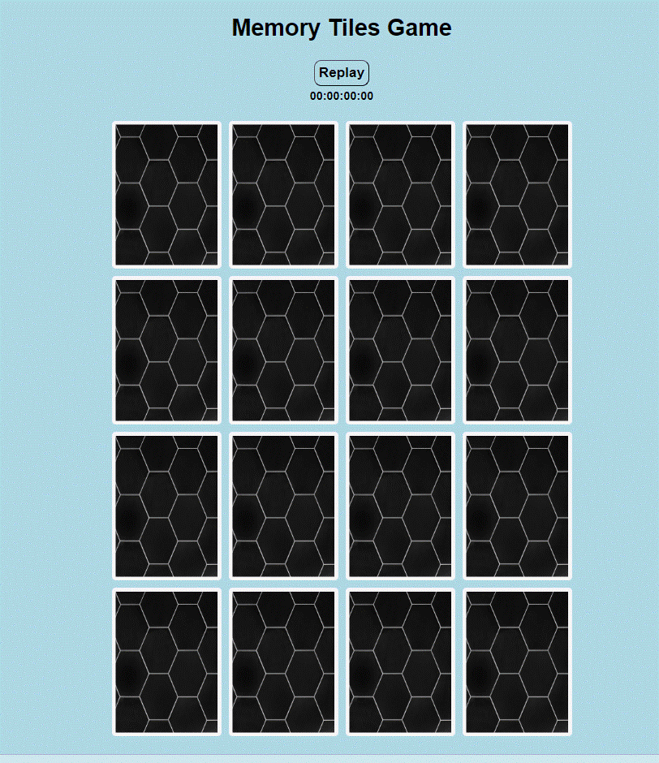
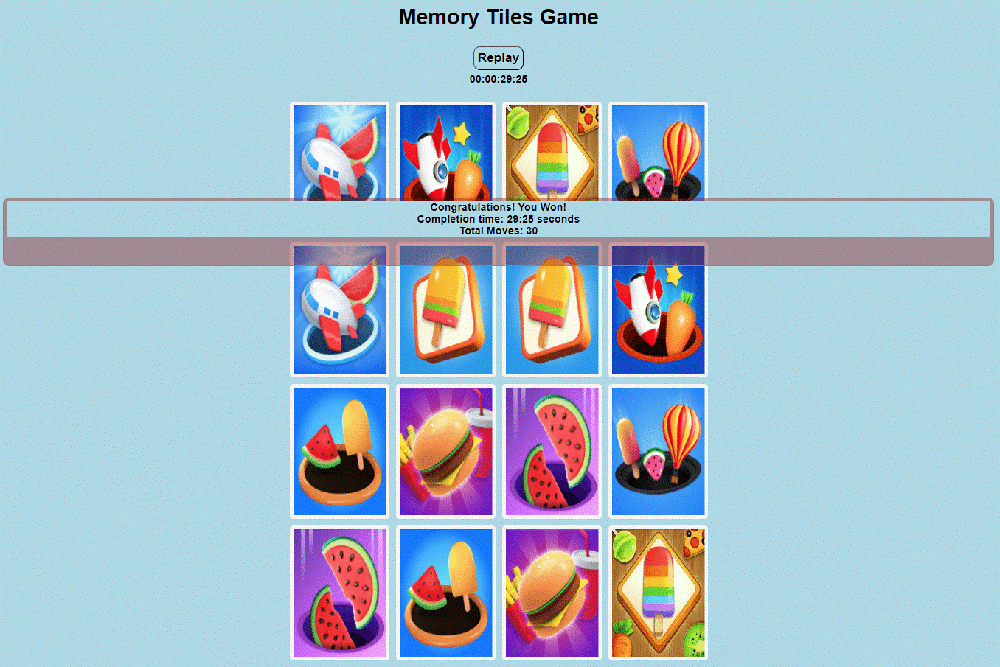

## Mini Project - 4*4 Memory Game
This is my First Mini Project Software Engineering Traning in Per Scholas. 
Every time you start a new game, a random positioning of the cards ensure you a different game than the previous one, so you can play as many times as you want!
Just click on "START" to start the game.

## Tech/framework used
- Javascript
- HTML 
- CSS

### Game Win Rule:
Match cards in less time with less moves.

### Game Rules:

1. Step 1 :  Beginning of the game
On the front Page, Memory Game button is available which will activate/restart the game.
At the beginning of the game, all the cards are mixed up and laid in cols and rows, face down on the table.

2. Step 2 : Start flipping Cards
If we click on Memory Game button, it will changes to start button to start the game.
Player start flipping cards, and at the same time StopWatch also starts and start button chnaged to Replay button. 

3. Step 3 : 
Player turns over 2 cards.

4. Step 4:
In this case, the cards don not match, it is not a pair, so he turns them back over.

5. Step 5 : 
Here, the player remembered the position of the cards and he turns over the two identical cards...

6. Step 6 : 
The two cards match, it is a pair! He keeps the cards and can play again...

7. Step 7 :
Player turns over two other cards.

8. Step 8 :
The two cards do not match, turns them back over, and so on...
When the player found all the pairs, the game is over. 
The player wins!
Player can replay the game with the help of replay button 

## Challenges 
### Technology:
* Knowledge of Dev Tools
* Knowledge DOM Monupulation concpets
* CSS grid and Flex concepts

### Momory Board Display during Game:
* Fliping cards back while replay
* Stopwatch Related issues
* Restart of new game with stopwatch at position 0:0 and all cards at original position

### Future Modifications:
* Add difficulty levels: Easy(4*4), Medium(6*6) and Hard(8*8)
* Calculate best time and best number of moves to finish game.
* 2 player game.

## Credits

[Reference Game](https://www.memozor.com/memory-games/for-2-players/casino/)

## You Can [Play Game](https://anujabujurge29.github.io/mini_project_Meomry_Game/) here!!